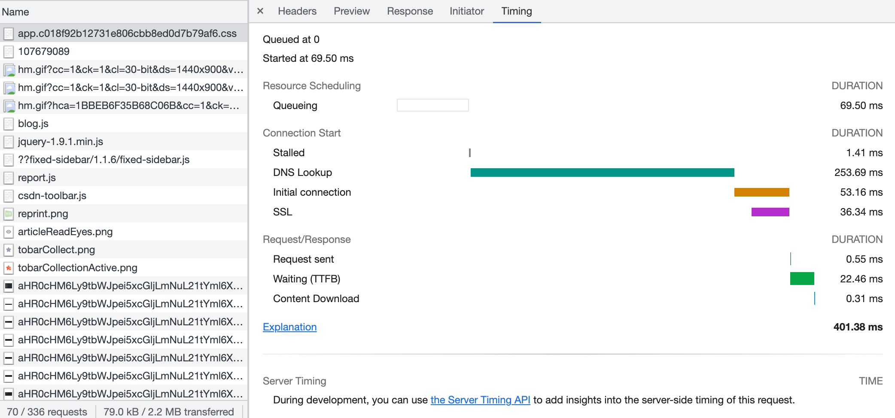

# 浏览器

浏览器作为网页呈现的工具，是我们`web`开发者使用最多的软件之一，下面提到的浏览器主要指`chrome`浏览器

## 为什么需要了解浏览器相关的知识？

我觉得可以从以下几个方面来思考这个问题

- 对开发和调试有帮助

  右键或者`F12`打开浏览器的调试工具`DevTools`，会发现里面有很多功能标签页，我自己用得比较多的有`Elements`查看元素，`Console`查看打印信息，`Sources`查看源码、断点调试，`NetWork`查看网络请求，`Application`查看`cookie`、`localStorage`等存储数据，偶尔用`Animations`查看一下动画

  上面的标签页使用都比较简单，但也有一些很多人不知道的小技巧，比如`Console`里`$_`、`$0`等作用，再比如`Sources`里`command`+`p`搜索文件

  而上面我没列举到的，比如`Performance`和`Memory`以及其他的标签页，则在性能分析、内存分析等问题上能够给我们帮助

- 对代码优化、性能优化有帮助

  了解浏览器的渲染步骤能帮助我们优化代码，比如最简单的为什么建议把`css`放在文档顶部，而把`js`放到文档底部?

  了解浏览器的重绘(`repaint`)与重排(`reflow`)，是理解一些优化手段的参考，比如为什么不建议使用`table`标签？

  了解浏览器的缓存知识，能够帮助我们利用缓存来提高网页访问速度，比如为什么打包文件要加版本号或者`hash`值？

- 对自己技术提升、面试能力提升有帮助

  这个很好理解，我们的知识储备多了，竞争力自然就强了

## 需要了解到什么程度？

 首先要明确的是，了解浏览器知识对前端开发有用，这是不用怀疑的，但至于了解需要达到什么程度，是只需要了解皮毛还是需要深入架构原理，我觉得这点可以商量的，以我目前的经验来讲，我觉得可以把浏览器知识分为以下几种：

- 基础，必须要掌握的

  这部分内容包括：`Elements`查看元素，`Console`查看打印信息，`Sources`查看源码、断点调试，`NetWork`查看网络请求，`Application`查看`cookie`、`localStorage`等存储数据

  以及，浏览器的重绘与重排，浏览器缓存等

- 进阶，最好掌握的

  这部分内容包括：浏览器性能指标，浏览器内存分析方法，浏览器垃圾回收，浏览器安全问题

- 其他

  其他的，比如浏览器架构，我个人目前没有涉及的，所以也给不出意见

## 从输入 URL 到页面呈现这个过程发生了什么？

这是一道很经典的面试题，包含的内容非常多，下面说说我的理解

首先，抛开缓存来讲，从 url 输入到页面呈现，简单来讲有以下这么几个过程（实际过程比这几个更多，更复杂）

1. DNS 解析
2. HTTP 请求
3. 浏览器渲染

缓存会发生在`DNS`解析和`HTTP`请求过程中

## DNS 解析

我理解的`DNS`解析即通过域名查找对应`ip`地址的一个过程

我们输入的`URL`通常是一个网址，比如`www.baidu.com`，但是浏览器网络通讯大部分是基于`TCP/IP`协议的，`TCP/IP`协议是基于`IP`地址的，所以需要把域名解析成`IP`地址

我知道的有关`DNS`的知识如下：

- 浏览器的`DNS`解析是有缓存的，即一个域名解析过了，下次处理的时候会直接走缓存，不经过解析

  `DNS`解析也是需要时间的，缓存可以节省这个时间，以前`chrome`可以访问`chrome://net-internals/#dns`来查看`DNS`的缓存，现在看不到了，只剩下一个`clear host cache`的按钮

- 系统`host`文件也可以设置`DNS`解析

  `host`文件一般默认会有`localhost`解析到`127.0.0.1`这个配置，所以访问`localhost`可以访问到本地，另外`host`配置也是本地开发调试的一个重要方法

- 系统可以设置`DNS`服务器

  `github`访问速度太慢的话，可以设置本机的`DNS`服务器为`114.114.114.114`或者`8.8.8.8`试试

## HTTP 请求

前面提到浏览器网络通讯大部分是基于`TCP/IP`协议的，`HTTP`协议也是如此，关于`HTTP`协议可以查看[这里](/browser/http)

`DNS`解析之后，浏览器会根据`IP`地址以及`URL`的路径发送`HTTP`请求，通常请求的是`html`文档，然后根据文档内容去加载其他资源（`css`、`js`、图片等）

`HTTP`请求缓存是浏览器缓存的重要部分，可以查看下方浏览器缓存

## DOM 树、CSSOM 树和渲染树

这部分涉及到浏览器是如何渲染页面的，通常会有以下几个步骤：

- 浏览器自上而下解析`html`，遇到外部`css`和图片，会另外发送请求去获取，此时不会终止`html`解析，遇到`js`则会终止`html`解析，加载并执行`js`，此步骤生成的是`DOM`树

- 浏览器解析`css`，`css`来源可能有很多，同一个元素的样式也可能是经过不同`css`的组合，所以浏览器需要计算出元素的最终样式，这一步生成的是`CSSOM`树，和上面生成`DOM`树是可以同步进行的

- 浏览器根据`DOM`树和`CSSOM`树生成渲染数

- 浏览器根据渲染树进行布局，渲染，以及更复杂的层级关系(`z-index`)处理，最终呈现出页面

- 浏览器根据用户操作对页面布局进行重绘或重排

在这一节我们需要知道：

- `css`的加载不会阻塞`html`的解析

  因为生成`DOM`树不需要`css`

- `css`的加载会阻塞页面的渲染

  因为生成渲染树需要`CSSOM`树

- `css`的加载会影响其后面的`js`的执行

  因为`js`在执行中可能获取元素样式，若`css`未加载完，则获取的样式不准确

- `js`的加载和执行会阻塞`html`解析

  因为`js`在执行过程中可能改变`dom`结构，比如`document.write()`

所以现在知道为什么推荐`css`放在页面顶部而`js`放在页面底部了吗？

## 重绘与重排

- 重绘，即元素的外观(颜色、背景色等)发生变化，但几何尺寸没变，浏览器会重新计算样式并渲染新页面

- 重排，即元素的几何尺寸发生改变，导致页面排版发生变化，浏览器不经需要重新计算样式，还需要重新生成渲染树并渲染新页面

重排的开销比重绘要大，以下操作会引起浏览器的重绘或重排：

- 元素的外观发生改变
- 元素的几何尺寸发生改变，盒模型所占空间变化
- `dom`元素的新增、移动或者删除
- `dom`元素的`display: none`触发重排，`visibility: hidden`触发重绘
- 用户滚动(`scroll`)、调整窗口大小(`resize`)
- `js`读取元素的`offsetHeight`、`scrollTop`和`clientHeight`等属性时会触发重排
- 调用`window.getComputedStyle`时会触发重排

重绘与重排会影响页面性能，但重绘和重排是不可避免的，我们可以做的是减少重绘重排的次数，通常有以下建议：

- 通过`class`名修改样式，而不是一步一步的修改`style`属性
- 通过`createDocumentFragment`创建一个不属于`DOM`树的节点，然后对`DOM`进行更新
- 对`resize`和`scroll`事件做防抖/节流处理
- 通过`will-change: transform`或者其他的方式将元素提升为合成层，开启`GPU`加速

  `transform`、`opacity`等属性可以开启`GPU`加速，这里有一个合成层对概念，我没有提到，因为我了解不深，想了解的可以参考[这篇文章](https://juejin.cn/post/6844903966573068301)

## 浏览器缓存

前面提到，`DNS`解析以及`HTTP`请求都会有缓存，这里主要讲一下浏览器`HTTP`请求的缓存

`HTTP`请求中，与缓存相关的请求头或者响应头有：

- `Expires`，过期时间，存在响应头中，告诉浏览器此资源的过期时间，是一个绝对时间

  存在的问题是客户端（浏览器）和服务器的时间可能不一致，所以判断缓存是否过期并不准确，所以在`http1.1`中被废弃

- `Cache-Control`，缓存控制，可以存在请求头，也可以存在响应头中，存在响应头中时，会覆盖`Expires`

  `Cache-Control`的指令比较多，而且可以是多个，用`,`隔开，指令存在与请求头或者响应头时意义是类似的，下面是`Cache-Control`常见的指令

  - `no-cache`，可以省略，表示不使用强缓存，但是要进行`HTTP`请求，进入协商缓存

    当我们在`chrome`的`DevTools`的`NetWork`勾选`Disable Cache`的时候，会发现所有资源的请求头都加上了`pragma: no-cache`和`cache-control: no-cache`两个字段，`pragma`字段是`HTTP1.0`历史遗留字段，只能以

  - `no-store`，表示不存储缓存，即真正意义上的不做任何缓存

  - `max-age`，作为响应头时，表示资源的有效时间，单位为秒

  - `public`，表示客户端和中间代理服务器都可以缓存

  - `private`，表示仅特定的客户端可以缓存，对我们来说一般指浏览器

- `ETag`，响应头，表示资源的唯一标识，资源变化则`ETag`会变化，与`If-None-Match`配合在协商缓存阶段使用

  `ETag`的优先级比`Last-Modified`高

- `If-None-Match`，请求头，值为`ETag`的值，询问是否匹配

- `Last-Modified`，响应头，表示最后修改时间

- `If-Modified-Since`，请求头，值为`Last-Modified`的值，表示是否在此时间之后修改

### 缓存流程

上面我习惯把响应放在前面，因为第一次请求时不会有缓存，第一次响应时，如果响应头包含`Cache-Control`或者`Expires`，则浏览器会将资源缓存(缓存的位置下面再讲)，等到第二次请求时，浏览器会检查`Cache-Control`的`max-age`是否过期，或者`Expires`是否过期，如果没有过期，则使用本地缓存，不发送新的`HTTP`请求，这一阶段被称为**强缓存**

如果`Cache-Control`或者`Expires`过期了，此时会像上面提到的，有`If-None-Match/ETag`和`If-Modified-Since/Last-Modified`两种配对情况，如果都存在则优先使用`If-None-Match/ETag`

浏览器会携带`If-None-Match`（或`If-Modified-Since`）请求头去询问服务器资源是否过期，服务器拿到`If-None-Match`（或`If-Modified-Since`）会跟文件的`ETag`（或`Last-Modified`）比较，如果一致则表示资源没有过期，服务器返回`304`状态码，浏览器使用本地缓存，如果不一致，则表示资源有更新，服务器返回`200`状态码和新的资源，浏览器使用新资源并缓存，这一阶段被称为**协商缓存**

### 缓存位置

我们在`DevTools`的`NetWork`中的`size`字段经常看到`memory cache`和`disk cache`，这就是缓存的位置，分别表示缓存在内存中和缓存在磁盘中

内存和磁盘各有优劣势，内存的优势读取块，劣势是内存空间有限，占用太多内存会导致系统卡顿，磁盘的优势是空间大，劣势是读取慢，所以根据这个特点很容易理解哪些资源会缓存在内存中，哪些会缓存在磁盘中

浏览器缓存位置还有下面几个地方，我没使用过

- `Service Worker`

  `Service Worker`能够拦截请求，所以可以用来做离线缓存，这也是`PWA`应用的实现机制

- `Push Cache`

  `http2.0`中的内容，我目前没涉及到

## 网页性能指标

网页性能优化我觉得是一个很大的话题，而一般情况下，普通开发很少遇到性能问题，或者说很少在意性能问题，因为如今设备的性能都比较好

但是我们应该知道如何统计一个网页的性能，以及在碰到性能问题时，知道如何去分析定位，然后如何解决，我觉得这才是普通开发了解网页性能优化的目的

通常讲网页性能指标，指的都是固定的一些值，比如`FP(First Paint)`，`FCP(First Contentful Paint)`，单独讲这个我觉得有点生硬，所以我选择从`DevTools`讲起

### NetWork 面板

首先看一下`NetWork`面板，直接查看最底部，有`DOMContentLoaded`时间和`Load`时间

`DOMContentLoaded`，表示`Dom`解析完成时触发，但是`css`，图片等资源不一定加载完成

`Load`，表示所有资源，包括`css`和图片都加载完时触发

所以是先触发`DOMContentLoaded`事件，再触发`Load`事件

我们选中一个请求，选中右侧的`Timing`，如下图所示

这里显示的是请求资源(`css`,`js`,图片、字体以及接口等)所花费的时间

- Queuing，表示浏览器调度排队时间

  浏览器在以下情况下会让请求排队等候：

  - 有其他优先级更高的请求

    比如图片的请求一般优先级比较低，

  - 达到了最大 TCP 连接数限制，通常是 6 个，只针对`http1.0`和`http1.1`

    这也是在`http1.1`时代，静态资源会分布在多个域名下的原因，而`http2.0`可以忽略这个限制

  - 浏览器正在分配`disk cache`的空间，会有短暂的排队

- Stalled，表示阻塞时间

  任何造成`Queuing`的原因，都可能造成`Stalled`

- DNS Lookup，表示 DNS 查询花费时间

  从图中可以看到，`DNS`查询花费的时间非常久，所以减少`DNS`查询时间也是优化的方向之一，但优化手段有限，我能想到的就是使用`dns-prefetch`或者`CDN`

- initial connection，表示初始化连接花费时间，一般

- SSL，表示 SSL 握手花费时间

- Request sent，表示发送请求花费时间，一般非常短

- Waiting(TTFB)，表示从请求发送到接收到第一个字节所花费的时间，`TTFB`是`Time To First Byte`的缩写

  这个时间比较重要，因为他可以反映服务器的响应时间，包括服务器接口的运算取数时间，和把结果返回给客户端的时间

  所以如果这个时间过长的话，要么是客户端与服务器之间的网络问题，要么是接口计算量大，需要优化

- Content Download，表示资源下载花费的时间

  这个接口反映的是服务器带宽以及资源大小的问题，如果时间过长的话，可以考虑调整带宽或者资源大小

### Performance 面板

`Performance`面板的内容太多了，`@TODO`可以单独写一篇文章说明如何使用

下面直接给出常用的性能指标，性能指标按照网页生命周期的不同时间段，可以分为加载时指标，渲染时指标和交互时指标

加载时的指标有以下几种：

- `TTFB, Time to First Byte`，即首字节时间，前面提到过`TTFB`的概念，我理解这里主要指的是请求`HTML`文档的那一次请求的`TTFB`

- `DCL，DOMContentLoaded Event`，即`DOMContentLoaded`事件，表示`dom`解析完毕

- `L，OnLoad Event`，即`load`事件，表示`dom`和`css`、图片等资源全部加载完毕

渲染时的指标有以下几种：

- `FP，First Paint`，首次绘制，表示从开始加载到浏览器首次绘制像素到屏幕上的时间，也就是页面在屏幕上首次发生视觉变化的时间。但此变化可能是简单的背景色更新或不引人注意的内容，它并不表示页面内容完整性，可能会报告没有任何可见的内容被绘制的时间。

- `FCP，First Contentful Paint`，首次内容绘制，表示浏览器首次绘制来自`DOM`的内容的时间，内容必须是文本、图片（包含背景图）、非白色的 `canvas` 或 `SVG`，也包括带有正在加载中的`Web`字体的文本

- `FMP，First Meaningful Paint`，首次有效绘制，页面的主要内容绘制到屏幕上的时间

- `LCP, Largest Contentful Paint`，最大内容绘制时间，表示从页面开始加载到用户与页面发生交互（点击，滚动）这段时间内，最大元素绘制的时间，该时间会随着页面渲染变化而变化，因为页面中的最大元素在渲染过程中可能会发生改变

- `SI，Speed Index`，示页面可视区域中内容的填充速度

- `FSP，First Screen Paint`，首次屏幕绘制，表示页面从开始加载到首屏内容全部绘制完成的时间，用户可以看到首屏的全部内容

交互时的指标有以下几种：

- `TTI，Time To Interactive`，可交互时间，表示网页第一次 完全达到可交互状态 的时间点，浏览器已经可以持续性的响应用户的输入。完全达到可交互状态的时间点是在最后一个长任务（Long Task）完成的时间, 并且在随后的 5 秒内网络和主线程是空闲的。

  这里有一个[Long Task](https://developer.mozilla.org/zh-CN/docs/Web/API/Long_Tasks_API)的概念，时间超过`50ms`的任务属于长任务

- `FID, First Input Delay`，首次输入延迟，表示用户首次输入到页面响应的时间

- `FPS, Frames Per Second`，帧率，是反映动画流畅度的标准，屏幕的刷新频率一般是`60Hz`，即`1s`刷新`60`次，有`60`帧，每帧的时间为`1s/60 = 16.7ms`，所以一般要求动画在`16.7ms`内完成

- `CLS，Cumulative Layout Shift`，累计布局偏移，表示布局期间发生的意外样式移动造成的布局偏移

其中`LCP`、`FID`和`CLS`又被称为核心指标，是网站性能的关键数据，`LCP`反映的是网页加载的时间，`FID`反映的是网页可交互的时间，`CLS`反映的是视觉稳定性

这么多指标已经让我有点晕了，心里也有很多疑惑，比如我该使用哪些指标？指标计算的方法是什么？平时提到的白屏时间、首屏时间又是什么？如何汇总这些指标并分析？带着这些疑问，我继续一个一个问题来寻找答案

#### 我该使用哪些指标？

#### 指标的计算方法？

#### 平时提到的白屏时间，首屏时间又是什么？

#### 如何统计指标数据并用来分析优化页面？

### Lighthouse 面板

`Lighthouse`面板的使用比较简单，我理解他是一个网页分析工具，会从`Performance`、`Accessibility`、`Best Practices`、`SEO`、`PWA`等 5 个方面去给网页打分并且给出优化建议

## 浏览器内存分析

## 浏览器安全问题

安全问题也是一个很大的话题，我能力有限，这里只提一下`https`的加密原理以及常见的网络攻击和防范

### HTTPS 加密原理

### 网络攻击和防范

#### XSS

`XSS`全称`Cross Site Script`，跨站脚本攻击，为了与`CSS`区分，所以改称为`XSS`

`XSS`的主要表现为利用用户输入的内容来执行`Script`脚本，比如利用`js`获取`cookie`，然后利用`cookie`来伪造身份

用户可以输入的地方包括`url`参数，各种输入框，而`XSS`的防范原则就是不相信任何用户输入的内容，对用户输入的内容进行`html`转义等

#### CSRF

`CSRF`全称`Cross Site Request Forgery`，跨站请求伪造，是挟持用户在当前已登录的网站上执行非本意的一些操作，而网站服务器只知道这些操作是用户浏览器发出的，并不知道是不是自愿发出的

`CSRF`的主要表现为，用户正常登录了网站 A，保存了`cookie`的信息，然后又访问了网站 B，网站 B 发起对网站 A 的请求，同时允许的话会携带网站 A 的`cookie`，那么此时网站 A 的服务器收到请求后，由于有`cookie`的信息，所以会认为是用户自己的操作

写到这里我有一个疑问，网站 B 发起对网站 A 的请求时，为什么不会被跨域拦截？又为什么会携带`cookie`？

- 为什么不会被跨域拦截？

  跨域也是浏览器的一种安全策略，但并不是所有资源请求都会发生跨域的，比如`img`的`src`不会跨域，可以用来伪造`get`请求，再比如`form`表单的提交也不会跨域，可以用来伪造`post`请求

- 为什么会携带`cookie`？

  携带`cookie`是浏览器的行为，满足以下条件浏览器就会自动携带`cookie`

  - 浏览器保存有相应的`cookie`
  - 请求的`URL`符合`cookie`的`domain`和`path`属性

  正因如此，`cookie`也新增了一个`Samesite`属性，可以用来防止`csrf`，但又会引入其他问题

`CSRF`的防范也可以从很多方面去考虑，比如说服务器验证请求的`refer`，`cookie`设置`samesite`属性，重要操作增加验证码，请求新增`csrf token`参数等，目的都是为了防止其他人能够伪造请求

下面着重讲一下`csrf token`的方式，服务器会生成一个随机的`token`，自己在`session`里保存一份，然后传给前端一份，前端在每次请求的时候，都带上这个`token`，服务器拿到请求后验证前端传递的`token`和自己保存的`token`是否一致

## 参考链接

[web.dev](https://web.dev/learn-web-vitals/)

[浏览器灵魂之问，请问你能接得住几个？ - 神三元](https://juejin.cn/post/6844904021308735502)

[浏览器层合成与页面渲染优化 - WecTeam](https://juejin.cn/post/6844903966573068301)

[还在看那些老掉牙的性能优化文章么？这些最新性能指标了解下 - yck](https://juejin.cn/post/6850037270729359367)

[Web Performance Metrics 与 Core Web Vitals 简介 —— 现代前端性能各个指标的具体含义和设计理念 - 字节前端](https://juejin.cn/post/6883444297614983175)

[前端性能优化指南[7]--Web 性能指标 - 茉莉蜜茶 only](https://zhuanlan.zhihu.com/p/371207168)

[脱离 996，Chrome DevTools 面板全攻略！！！（收藏）- SHERlocked93](https://blog.csdn.net/qianyu6200430/article/details/107679089)

[Chrome Devtool — Performance - @Demi](https://blog.csdn.net/qq_38128179/article/details/104491149)

[前端安全系列之二：如何防止 CSRF 攻击？](https://juejin.cn/post/6844903689702866952)
