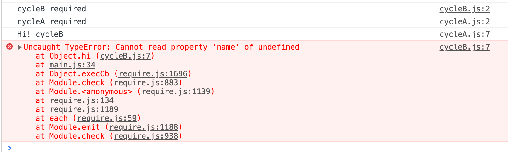

# 模块化

模块到底是什么？似乎是一种只能意会不能言传的东西。

我理解的模块，是一个独立完成某个功能的代码，它不会污染全局变量，只是对外暴露接口。使用者调用接口实现某个功能，而不关心模块内部是如何实现这个功能的。

在`ES Module`规范出来之后，其他规范都会慢慢退出舞台，所以本文的重点将会是`ES Module`

## 无模块时代

在早期开发的时候，我还没有模块化这个概念，当时还是手动引入`js`文件，如果想使用`jquery`，那`jquery`的引入必须放在自己的`js`文件上面，有时候还会在一个文件使用另一个文件的全局变量或者函数。所以总结一下在无模块化的时候存在的一些问题：

- 手动管理依赖（`jquery`需要放在最上面）,且依赖关系不明确
- 作用域混乱，太多的全局变量，命名及管理都比较困难，容易冲突

## CommonJS 规范

最开始`js`只能在浏览器环境中运行，`CommonJS`规范的目标是让`js`可以在服务端、命令行、桌面应用等地方运行

`nodejs`是遵循`CommonJS`规范的代表，但随着`js`官方的模块化解决方案（及 ES Module）的出现，`nodejs`也逐步在转向`Es Module`模块化方案

在`nodejs`中，每个文件就是一个模块，有自己的作用域，在一个文件里定义的变量、函数都是私有的，除非主动暴露出去，否则其他文件不能访问

```js
// a.js
const a = 1;

// b.js
console.log(a); // undefined
```

在浏览器中，当我们在`a.js`文件中声明变量`const a = 1;`时，`a`自动挂载到`window`上，及`window.a`的值为`1`，然后`b.js`可以访问变量`a`

在`nodejs`中也有类似`window`的存在，及`global`，但是当我们在`a.js`文件中声明变量`const a = 1;`时，`a`并不会自动挂载到`global`上面，除非主动声明`global.a = a`

### 定义模块

前面提到，每个模块都有自己的作用域，除非暴露出去，否则无法被其他模块访问，那么暴露出去的方法就是使用`module.export`

新建一个`commonjs.js`文件，输入`console.log(module)`，然后用`node`执行文件`node commonjs.js`，会打印出`module`到底是个啥

```js
Module {
  id: '.',
  path: '',
  exports: {}, // module.exports就是这个东东
  parent: null, // 入口文件为null，其他文件为require的文件
  filename: '',
  loaded: false,
  children: [],
  paths: []
}
```

为了方便，`nodejs`在实现`CommonJS`规范时，为每个模块提供了`exports`私有变量，指向`module.exports`，及`exports === module.exports`，所以`module.exports.a = 1`可以简写为`exports.a = 1`

但需要注意但是，不能直接对`exports`赋值，及不能写`exports = xxx`，这样会破坏`exports` 与`module.exports`的链接性，如果不知道该用哪一个，建议只使用`module.exports`，放弃`exports`

### 加载模块

`require`是加载其他模块的方法，会读取并**执行**模块，然后返回该模块的`module.exports`对象

第一次加载某个模块时，`nodejs`会缓存该模块，之后再加载该模块时，会直接从缓存中读取`module.exports`属性

怎么理解只在第一次加载时执行并且会被缓存呢，来看下面的例子：

```js
// a.js
let name = 'a';
const obj = {
  name: 'a',
};

console.log('a is required');

const setName = newName => {
  name = newName;
  obj.name = newName;
};

const getName = () => name;

module.exports.name = name;
module.exports.obj = obj;
module.exports.setName = setName;
module.exports.getName = getName;

// b.js
const a = require('./a'); // 会打印 a is required

console.log(a.name); // a

a.setName('A');

console.log(a.name); // a

console.log(a.obj.name); // a
console.log(a.getName()); // A

const a2 = require('./a'); // 不会打印 a is required

console.log(a2.name); // a

console.log(a2.getName()); // A

console.log(a2 === a); // true
```

可以看到，只有在第一次`require`的时候，`a.js`里面的`console`才会被执行，并且在`b.js`中调用`a.setName`并不能更新`a.name`

想要获取 name 的最新值，可以使用函数`getName`来获取，或者利用对象的引用`obj.name`来获取

为什么`obj.name`能获取最新值，但`name`不会获取最新值呢？这其实就是值和引用的原因，`require`得到的是暴露出来的**值的拷贝**，虽然`setName`更新了`a.js`中的变量`name`，但`a.js`并没有重新执行，`module.exports.name`的值并没有改变

缓存如何删除呢？想删除缓存首先得知道缓存在哪，`nodejs`的模块缓存在`require.cache`里，它是一个对象，`key`是模块的路径，`value`是模块的`module`，删除缓存即删除`require.cache`中对应的值

```js
// 接上面的例子，在b.js中打印模块a.js的缓存
console.log(require.cache[require.resolve('./a')]);

/**
 * id:'',
 * path: '',
 * exports: {
 *    name: 'a',
 *    obj: { name: 'A' },
 *    setName: [Function setName],
 *    getName: [Function getName]
 * },
 * parent: {
 *
 * }
 * ...
 */
```

### 循环依赖

循环依赖，顾名思义就是依赖关系形成了一个闭环，例如`a.js`依赖了`b.js`，`b.js`又依赖了`a.js`

`CommonJS`处理循环依赖的做法是，一旦出现某个模块被"循环加载"，就只输出已经执行的部分，还未执行的部分不会输出。来看下面的例子

```js
// cycleA.js
const cycleB = require('./cycleB.js');

console.log('value of cycleB:', cycleB);

module.exports = 'This is cycleA.js';

// cycleB.js
const cycleA = require('./cycleA.js');

console.log('value of cycleA:', cycleA);

module.exports = 'This is cycleB.js';

// cycle.js
require('./cycleA');
```

执行`node cycle.js`会打印什么？思考一下...

<details>
  <summary>查看答案</summary>
  
  ```js
  value of cycleA: {}
  value of cycleB: This is cycleB.js
  ```
</details>

解释一下执行过程：

- 加载`cycle.js`， `require.cache`里已经有`cycle.js`的缓存，值是默认值
- 加载`cycleA.js`，`require.cache`里已经有`cycleA.js`的缓存，值是默认值
- 加载`cycleB.js`，`require.cache`里已经有`cycleB.js`的缓存，值是默认值
- 再次加载`cycleA.js`，取`require.cache`缓存中的`cycleA.js`的值，`cycleA = {}`
- 执行`cycleB.js`中`console.log('value of cycleA:', cycleA);`，打印`value of cycleA: {}`
- 执行`cycleB.js`中`module.exports = 'This is cycleB.js'`，更新缓存`require.cache`里`cycleB.js`的值
- 执行`cycleA.js`中`console.log('value of cycleB:', cycleB);`，此时`cycleB`已经执行完毕，`cycleB = 'This is cycleB.js'`, 所以打印`value of cycleB: This is cycleB.js`
- 执行`cycleA.js`中`module.exports = 'This is cycleA.js'`，更新缓存`require.cache`里`cycleA.js`的值
- 执行结束

如果在`cycle.js`里打印一下`require.cache`，会发现缓存都变成了最新值，所以我觉得可以把`module.exports`理解为更新缓存

## AMD 规范

`CommonJS`规范的目标是让`js`能够在非浏览器环境下运行，但在浏览器环境，它的表现反而不理想，因为`CommonJS`规范定义一个文件就是一个模块，而浏览器加载`js`文件要经过网络请求，为了减少延迟通常会合并多个`js`文件，这与一个文件就是一个模块似乎是矛盾的，当然这只是我个人的看法，总之`CommonJS`规范并不适用于浏览器环境，所以有了`requirejs`以及它推广的`AMD`规范

在当前`ES Module`统一的环境下，我觉得简单了解一下`requirejs`即可

### 初始化

在`html`文件里引入`requirejs`，并设置`data-main`属性来指定入口文件，要注意入口文件需要在调用其他模块之前，例如

```html
<script data-main="js/main" src="js/require.js"></script>
```

在入口文件`main.js`中，一般会先调用`requirejs.config`来配置，然后再加载模块实现自己的逻辑，例如

```js
// main.js
require.config({
  /**
   * 查找模块的根目录
   * 在有config的情况下，baseUrl以config配置的为准
   * 如果没有设置config，默认是加载requirejs的html文件的目录
   * 如果设置了data-main属性，默认值就是data-main前面的目录
   */
  baseUrl: '/another/path',
  paths: {
    some: 'some/v1',
  },
  shim: {
    // 定义第三方库，如lodash
    lodash: {
      exports: '_',
    },
  },
});

require(['some/module', 'my/module', 'a.js', 'b.js'], function(
  someModule,
  myModule,
) {
  // 可选回调函数，在依赖列表都加载完之后会执行
  // 值得注意的是，此函数可能在页面加载完之前执行
});
```

### 定义模块

```js
define(id?, dependencies?, factory)
```

`id`，可选参数，表示这个模块的唯一标识，但是一般推荐不加这个参数，而是让`requirejs`自动管理模块模块标识

`dependencies`，可选参数，表示这个模块依赖的模块，我理解这就是所谓的`依赖前置`，在定义模块的时候就将依赖加载

`factory`，模块初始化函数或对象，如果是对象，则对象本身就是模块输出，如果是函数，函数只能执行一次，函数返回结果即为模块输出

`factory`还可能是以`CommonJS`的形式存在，具体看下面的例子：

```js
define({
  name: 'requirejs',
  type: 'AMD',
});

define(function() {
  // do something
  return {
    name: 'requirejs',
    type: 'AMD',
  };
});

define(['a', 'b'], function(a, b) {
  // do something

  return {
    name: 'requirejs',
    type: 'AMD',
  };
});

define(function(require, exports, module) {
  // 这里的require，exports，module与CommonJS规范中用法类似
  const a = require('a');
  const b = require('b');
  // do something
  return {
    name: 'requirejs',
    type: 'AMD',
  };
});

define(['require', 'a'], function(require, a) {
  // 但这样写是不可以的
  // 如果提供了依赖数组，那么requirejs不会去函数体内寻找依赖
  const b = require('b'); // b 会是undefined
  // do something
  return {
    name: 'requirejs',
    type: 'AMD',
  };
});
```

### 加载模块

一般在`define`的时候就会指定有哪些依赖，然后`requirejs`会自动加载对应的模块

还有一种情况是按需加载的模块，比如在点击某个按钮才加载模块

<a href="/examples/javascript/module/amd/test.html" target="_blank">requirejs 的异步加载与按需加载</a>

```js
define(function() {
  console.log('main required'); // 只会打印一次，因为模块初始化函数只会执行一次

  const btn = document.getElementById('alert');

  btn.onclick = () => {
    require(['./alert'], function(myAlert) {
      myAlert('i am myAlert'); // 回调函数后执行，即使alert.js已经加载过了
    });
    alert('i am before myAlert'); // 这里会先执行，因为require是异步的，它提供了回调函数
  };
});
```

#### `requirejs`模块文件解析规则

我个人没有很多的`requirejs`经验，只能说了解`requirejs`，但在学习或者写 demo 的时候，我纠结的是当定义`dependencies`的时候，`requirejs`是根据什么来查找模块的？

前面提到，`requirejs`不推荐在`define`的时候加上`id`参数，让`requirejs`自己去管理，而`requirejs`是根据`baseUrl`以及`id`来查找模块的，`baseUrl`是一个路径，所以我理解`id`也是一个路径，具体规则如下：

- 以`/`开头，表示绝对路径，比如`/a/b/c`会取值`www.example.com/a/b/c.js`
- 以`.js`结尾，表示相对路，相对的值是加载`requirejs`的 html 路径
- 以`http`或`https`开头，表示远程路径
- 其他情况均表示相对`baseUrl`的路径

以上规则是指在没有`paths`配置的情况下，如果配置了`paths`会有一些替换规则，这里不展开了

### 循环依赖

```js
// cycleA.js
define(['cycleB'], function(cycleB) {
  return {
    name: 'cycleA',
    hi: function() {
      console.log('Hi! ' + cycleB.name);
    },
  };
});

// cycleB.js
define(['cycleA'], function(cycleA) {
  return {
    name: 'cycleB',
    hi: function() {
      console.log('Hi! ' + cycleA.name);
    },
  };
});

// main.js
require(['cycleA', 'cycleB'], function(cycleA, cycleB) {
  cycleA.hi();
  cycleB.hi();
});
```

思考一下打印结果...

<details>
  <summary>查看答案</summary>



</details>

可以看到在`cycleB.js`中，`cycleA`为`undefined`，调换`main.js`中模块的加载顺序会得到不同的结果，但总会有一个是`undefined`

解决循环依赖的方法是在`define`内部重新`require`，上面的例子变为：

```js
// cycleA.js
define(['require', 'cycleB'], function(require, cycleB) {
  console.log('cycleA required');
  return {
    name: 'cycleA',
    hi: function() {
      cycleB = require('cycleB');
      console.log('Hi! ' + cycleB.name);
    },
  };
});

// cycleB.js
define(['require', 'cycleA'], function(require, cycleA) {
  console.log('cycleB required');
  return {
    name: 'cycleB',
    hi: function() {
      cycleA = require('cycleA');
      console.log('Hi! ' + cycleA.name);
    },
  };
});

// main.js
require(['cycleA', 'cycleB'], function(cycleA, cycleB) {
  cycleA.hi();
  cycleB.hi();
});
```

## CMD 规范

`CMD`规范是`sea.js`遵循的规范，这里不深入讨论`sea.js`，因为它跟`CommonJS`很类似，甚至说跟`requirejs`也有点像，主要讨论一下`sea.js`与`requirejs`的区别，我觉得主要的区别是加载`js`文件以及执行`js`文件的时机是不一样的，通过对比下面两个链接可以发现一些不同

<a href="/examples/javascript/module/amd/test.html" target="_blank">requirejs example</a>

<a href="/examples/javascript/module/cmd/test.html" target="_blank">seajs example</a>

打开`console`可以看到，`requirejs`的依赖是提前执行的（相当于`require('mod1')`和`require('mod2')`被放到最前面执行），且加载的`js`文件不包含`cycleA.js`和`cycleB.js`

`sea.js`的依赖是就近执行的，但是加载的`js`文件包含`cycleA.js`和`cycleB.js`，而明明要点击按钮才会执行`require('cycleA')`，说明`sea.js`是把所有`require`语句相关的`js`文件都提前加载了（没有执行，等真正调用的时候才会执行，这也是`sea.js`的代码可以`同步`书写的原因，其加载`js`文件还是`异步`的），想实现点击后再加载文件可以用`require.async`

上面的例子只是为了对比两者不同的机制，并不是真正的用法，实际使用两者都能达到模块化的目的。

## UMD 规范

UMD 规范我理解为一个集合，它兼容了`CommonJS`和`AMD`规范，常见的写法见下方，是不是感觉似成相识？

```js
(function(root, factory) {
  if (typeof defined === 'function' && define.amd) {
    // AMD 风格
    define(factory());
  } else if (typeof module === 'object' && typeof module.exports === 'object') {
    // CommonJS 风格
    module.exports = factory();
  } else {
    // 全局对象
    root.returnExports = factory();
  }
})(typeof self !== 'undefined' ? self : this, function() {
  return {};
});
```

## ES Module

重点来了，前面提到的规范都不是语言层面的标准，都是在代码运行后才能确认导出的内容，而`ES Module`是真正意义上的语言标准，可以成为服务端与浏览器的通用解决方案，`nodejs`从`13.2.0`版本开始打开了`ES Module`的支持

不过虽然`nodejs`支持`ES Module`的写法，但毕竟之前用了那么久的`CommonJS`，不可能废弃，所以`nodejs`用`.mjs`表示`ES Module`规范的模块，用`.cjs`表示`CommonJS`规范的模块，或者在`package.json`声明`"type": "module"`，则默认采用`ES Module`规范

一般个人代码是不建议两种规范混合使用的，但第三方代码难免会遇到规范不一致的情况，如何混合使用可以参考[Node.js 如何处理 ES6 模块](http://www.ruanyifeng.com/blog/2020/08/how-nodejs-use-es6-module.html)

还有一点可以提一下，平时开发的时候，`import`我们习惯不写文件后缀，也不写`index`，这其实是`webpack`(见`resolve`配置)等工具帮我们处理了，并不是`ES Module`默认可以这么写

### export、import 的各种写法

`ES Module`采用`import`和`export`来导入导出模块，虽然只有两个关键字，但写法有多种，且刚开始容易混淆

```js
// util.js

// 命名导出，一个模块可以有多个
export const a = 1;
export const add = (a, b) => a + b;

// 默认导出，一个模块只能有一个
// default 其实相当于另一个命名导出，名字就是default
// 这个default可能会引起一些问题，特别是跟其他模块规范交互的时候，因为其他规范没有默认导出这个概念
export default addOne = x => add(1, x);
```

```js
// main.js

// 默认导入
import lib from './util.js';
// 跟上面等价，一般也不会这么写
import { default as lib } from './util.js';

// 全部导入，可以打印一下lib看一下都有啥，一般ts里建议这么写
import * as lib from './util.js';

// 命名导入，只能导入被导出的名字
import { a, add } from './util.js';
```

```js
export { default as lib } from './utils.js';

// 等价于
import lib from './utils.js';
export default lib;
```

```js
// 动态导入

import('./utils.js').then(lib => {
  // 这里的lib是全部导入的，所以要使用的话一般需要加上default
  console.log(lib);
});
```

```js
const a = 1;
export default a;
// 这两个不是完全一样的，可以参考https://stackoverflow.com/questions/39276608/is-there-a-difference-between-export-default-x-and-export-x-as-default/39277065#39277065
// 我试了一下，import 得到的直接是1，而不是变量a = 1, 所以赋值a =5会直接报错，不能这么写
export { a as default };
```

```js
// util.js
export default {
  a: 1,
  b: 2,
};

// main.js
// 这种写法完全是错误的，util.js里面并没有命名导出a和b
import { a, b } from './util.js';
```

### TreeShaking

翻译为树摇，想象一下使劲摇一棵树的样子，狗狗甩掉身上水的样子，可以很形象的理解`TreeShaking`

由于`js`文件一般都是通过网络加载的，所以其大小显得十分重要，所以我们不希望把无效的代码给加进去，这就要求我们自身养成良好的编码习惯，不要有未使用的变量和不可执行的代码。

`TreeShaking`的作用是去掉`dead-code`(没用到的、不被执行的代码)，在`TreeShaking`之前，`uglifyjs`等库也可以做到检测无效代码并删除，但它需要把所有代码都检测一遍，即先打包再检测删除，而得益于`ES Module`的静态模块结构（模块在编译时确定，运行时不会改变），`TreeShaking`可以加快删除无效代码的速度和效果。

`webpack`关于`TreeShaking`的配置请参考[这里](/tools/webpack#treeshaking)

参考：

[前端科普系列-CommonJS：不是前端却革命了前端](https://zhuanlan.zhihu.com/p/113009496)

[JavaScript 模块的循环加载](http://www.ruanyifeng.com/blog/2015/11/circular-dependency.html)

[模块化利器: 一篇文章掌握 RequireJS 常用知识](https://www.cnblogs.com/lyzg/p/4865502.html)
