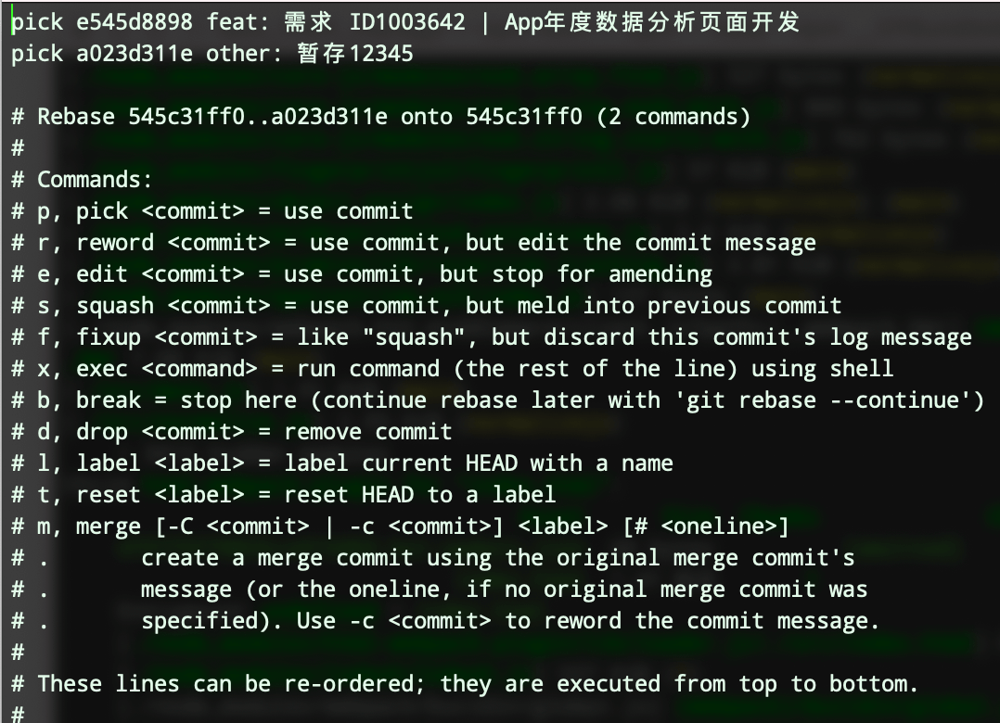

# Git

## 1. 基本操作

### 1.1 git 配置

`git`的安装就不赘述了，通常在`git`安装之后我会做以下配置：

```bash
git config --global user.name 'xxx'
git config --global user.email 'xxx'
git config --global core.autocrlf false
git config --global core.safecrlf true
```

`windows`上安装`git`的时候也会有三个选项让用户选择，大概是`commit unix, checkout windows`，`commit windows, checkout windows`，`commit as it is ,checkout as it is`这三个选项，这其实就是在配置`autocrlf`

`crlf`是回车(CR, `\r`),换行(LF, `\n`)的意思，我们都知道`windows`上一般是回车换行`\r\n`结尾（CRLF），而`Linux/Unix`上一般是`\n`结尾（LF）

多人合作时，如果开发平台不一样，`windows`平台上可能会出现`ESLint`报`CRLF`相关的错误，因为`ESLint`默认要求是已`LF`结尾的，上面的配置可以解决这个问题，当然，`editorconfig`也可以统一换行符风格。

`autocrlf`取值`false`表示提交和检出代码时，均不做`CRLF`和`LF`相关的转换，原来是什么样就是什么样

`safecrlf`取值`true`表示拒绝提交包含混合换行符的文件，即：都用`LF`

下面是配置命令的别名，我习惯使用`git st`代替`git status`，`git co`代替`git checkout`，`git br`代替`git branch`

```bash
git config --global alias.st status
git config --global alias.co checkout
git config --global alias.br branch
```

### 1.2 仓库初始化

远程新建仓库，本地拉取仓库

```bash
git clone git@xxxx
```

本地初始化仓库，关联远程新仓库

```bash
git init
git remote add origin git@xxx
```

### 1.3 拉取代码

#### 1.3.1 `git fetch`

我个人使用`git fetch`的次数并不多，这里拿出来讲是为了更好的理解`git pull`

`git fetch`获取远程的更新并产生一个`FETCH_HEAD`，`FETCH_HEAD`里包含的信息供其他脚本或者`git`命令使用

#### 1.3.2 `git pull`

默认情况下，`git pull` = `git fetch` + `git merge`

而`git merge`默认情况下又会以`--ff`，即：`Fast Forward`模式合并代码，在`--ff`模式下

如果远程分支有更改，本地分支没更改，`git merge`不会产生一个新的提交

如果远程分支和本地分支都有更改，`git merge`就会产生一个合并提交，类似`Merge branch develop of xxxx(远程地址) into develop`，意思就是把远程的`develop`分支与本地的`develop`分支合并

---

如果`git pull`加上`--rebase`参数，那么合并分支就是采用`git rebase`而不是`git merge`，即：

`git pull --rebase` = `git fetch` + `git rebase`

`windows`安装`git`的时候，也会询问用户`git pull`默认是采用`git merge`还是`git rebase`，关于两者之间的区别，下面会讲到

### 1.4 推送代码

`git push`表示推送代码到远程，默认表示把当前本地分支(例如`develop`)推送到远程同名分支，即`git push` = `git push origin develop`

如果本地分支没有与远程分支关联，会提示使用`git push --set-upstream origin develop`，`--set-upstream`我习惯简写为`-u`，即：

`git push -u origin develop`

### 1.5 分支管理

#### 1.5.2 查看分支

`git branch`查看本地分支列表，`git branch -r`查看远程分支

#### 1.5.2 切换分支

`git checkout develop`会切换到本地`develop`分支，本地没有`develop`分支则会拉取远程`develop`分支，远程也没有`develop`分支的话则会报错

如果是别人刚推送的新分支，自己则需要`git pull`更新一下本地的信息再`git checkout`

#### 1.5.1 新建分支

`git branch new-branch`基于当前分支新建名为`new-branch`的分支，但是不会切换到`new-branch`分支，所以一般也不用这个

一般使用`git checkout -b new-branch`，基于当前分支新建名为`new-branch`的分支并切换到`new-branch`分支，即

`git checkout -b new-branch` = `git branch new-branch` + `git checkout new-branch`

#### 1.5.2 删除分支

`git branch -d new-branch`删除名为`new-branch`的分支

`git branch -D new-branch`**强制**删除名为`new-branch`的分支

### 1.6 分支合并

假设有以下分支，`master`为主分支，`feature`为自己的分支


#### 1.6.1 `git merge`


前面提到`git merge`默认会使用`Fast Forward`模式，可能不会产生合并提交，也就无法保存分支信息

`git merge --no-ff`，非`Fast Forward`模式，总是会产生一个合并提交

我个人习惯用`git merge --no-ff --no-commit`来合并分支，`--no-commit`表示不自动提交，不加的话在**没冲突**的情况下会自动提交合并的代码

加上`--no-commit`的好处是可以检查合并的代码是否符合预期

#### 1.6.2 `git rebase`


`git rebase`表示变基，我理解为把当前分支的提交在新的“基础”上再提交一遍，相比于`merge`，`rebase`能够让`git`树保持相对简洁

当然，`rebase`的作用不仅仅是合并代码，加上`-i`参数后可以有更多的功能，例如**修改提交信息**，**合并多个提交**

`git rebase -i`会有多个命令供选择，命令列表及其用法如下图：



- `p`(pick，采用这次提交)
- `r`(reword，采用这次提交，但是修改提交信息)
- `e`(edit，采用这次提交，但是修改提交内容)
- `s`(squash，采用这次提交但是合并到上一个提交里，保留提交信息)
- `f`(fixup, 类似 squash，不保留提交信息)
- `d`(drop, 去掉这次提交)

剩下的`x(exec)`, `b(break)`等命令我没用过，还不知道具体能做些什么

`rebase`和`merge`还需要熟悉两个参数：

- `--continue`，继续操作，通常在解决完冲突或者检查完代码确认可以合并后使用
- `--abort`，终止操作，通常在不确定能否合并时使用

这里也顺带讲一下`vim`编辑界面的基本操作，`merge`和`rebase`通常会进入一个`vim`编辑界面，只需要记住以下几个操作就可以：

- 按`i`进入编辑模式，此时才可以编辑内容
- 按`esc`退出编辑模式
- 退出编辑模式之后，一般输入`:wq`保存并退出，输入`:q`是退出，输入`:q!`是不保存强制退出

### 1.7 tag 标签

`tag`一般用来标记版本, 可以分为轻量标签和附注标签，轻量标签不会保存打标签者的个人信息和时间，也不包含标签说明，一般我们使用附注标签

- `git tag v1.0`会打一个轻量标签
- `git tag -a v1.0 -m "1.0版发布"`会打一个附注标签
- `git tag`，`git tag -l`和`git tag --list`都可以查看标签列表
- 默认情况下`git push`不会推送标签到远程，可以直接推送标签`git push origin v1.0`或者`git push --tags`把远程没有的本地标签都推送到远程
- `git tag -d v1.0`删除标签`v1.0`
- `git checkout v1.0`切换到标签`v1.0`

## 2. 工作流

熟悉`git`的基本命令只是使用`git`管理代码的第一步，通常情况下，我们身处一个团队，需要团队协作，需要有规范的提交信息，需要有规范的开发测试以及版本发布流程。

### 2.1 规范提交信息

#### 2.1.1 制定规范

提交信息的作用主要是简短明了的说明本次提交的内容，有利于审阅以及合并代码，我们可以借用第三方库来定制提交规范，避免不符合规范的提交成功

业界常用的提交规范是[`Angular`的提交规范](https://github.com/angular/angular.js/blob/master/DEVELOPERS.md#-git-commit-guidelines)，此规范将一次提交划分为以下几个部分：

```bash
<type>(<scope>): <subject>
#空一行
<body>
#空一行
<footer>
```

`type`表示提交类型，有以下值可选：

- `feat`，新特性，新功能
- `fix`，修改 bug
- `docs`，修改文档
- `style`，不影响功能的修改，例如空格，格式化，分号等
- `refactor`，重构既有功能，既不是新功能，也不是修改 bug
- `perf`，性能优化
- `test`，测试代码新赠或修改
- `chore`，构建工程或者辅助工具修改，例如文档生成工具

`scope`表示影响范围，可选，我一般不用，因为这还涉及到模块划分

`subject`表示本次修改的描述，要求简洁明了

`body`表示对`subject`补充，我一般不用

`footer`用来记录`BREAKING CHANGE`和标注本次提交修改了哪些`issue`提到的问题

上述规范比较适用于开源项目，而对于公司业务型的项目可以精简一下，大多数情况只需要`type`和`subject`就够了

#### 2.2.2 避免不规范的提交

制定规范之后，如果不采取手段的话，只能靠个人自觉来遵守，所以必要时可以采取一定的手段来让不规范的提交提交失败，一般使用[`husky`](https://www.npmjs.com/package/husky)搭配[`commitlint`](https://www.npmjs.com/package/commitlint)

- `husky`

`Git Hooks`的工具函数，让我们能更好的使用`Git Hooks`钩子函数，我在写这篇文章的时候发现`husky`已经升级到`v5`了（但是，只能开源项目或者赞助者使用`v5`版本），且较`v4`相比使用有了变化，所以这里干脆把`v4`和`v5`两个版本的使用方法都列举一下

```js
// v4
// package.json里配置
{
  ...
  "husky": {
    "pre-commit": "npm run eslint && jest", // 提交前钩子，一般用来做eslint检查，prettier格式化检查，jest测试等
    "commit-msg": "commitlint -E HUSKY_GIT_PARAMS", // 提交信息检查
  }
  ...
}
```

```bash
# v5改为在.husky目录配置
# .husky/pre-commit
# 如果是npm脚本，直接运行npm run xxx
# 如果是本地安装的命令行，则需要通过包管理器（npm or yarn）来运行
npm run eslint

npx --no-install jest
#or
yarn jest
```

```bash
# v5改为在.husky目录配置
# .husky/commit-msg
# HUSKY_GIT_PARAMS变为原生的参数
npx --no-install commitlint --edit $1
#or
yarn commitlint --edit $1
```

- `commitlint`

我们可以使用第三方的`commitlint`配置来检查提交，也可以自定义配置，下面是我的自定义配置，我一般只检查`type`和`subject`两项内容

```js
// commitlint.config.js
const showTips = () => {
  console.log('提交格式：type: subject，type为提交类型，subject为提交说明');
  console.log('subject格式：需求 IDxxx | 文字说明文字说明');
  console.log('例：');
  console.log('feat: 需求 ID1002399 | 多级满赠券导购开单页面开发');
  console.log(
    'bug: 需求 ID1002399 | 多级满赠券导购开单 开单成功页面活动储值卡不显示图片',
  );
};

module.exports = {
  rules: {
    'type-lint': [2, 'always'],
    'subject-lint': [2, 'always'],
  },
  plugins: [
    {
      rules: {
        'type-lint': ({ type }) => {
          const TYPES = ['feat', 'bug', 'history', 'other'];
          const pass = TYPES.indexOf(type) >= 0;
          if (!pass) {
            showTips();
          }
          return [
            pass,
            "type只能是['feat', 'bug', 'history', 'other']中的一种",
          ];
        },
        'subject-lint': ({ type, subject }) => {
          if (subject === null) subject = '';
          const hasFeatID = subject.includes('需求 ID');
          const hasBugID = subject.includes('BUG ID');
          const index = Math.max(subject.indexOf('|'), subject.indexOf('｜'));
          const isSimple = index < 0 || subject.length - index < 5;
          switch (type) {
            case 'feat': {
              const pass = hasFeatID && !isSimple;
              if (!pass) {
                showTips();
              }
              return [pass, 'subject必须包含需求ID，且需要说明需求内容'];
            }
            case 'bug': {
              const pass = hasFeatID && hasBugID && !isSimple;
              if (!pass) {
                showTips();
              }
              return [pass, 'subject必须包含需求ID和BUG ID，且需要说明BUG内容'];
            }
            case 'history': {
              const pass = hasBugID && !isSimple;
              if (!pass) {
                showTips();
              }
              return [pass, 'subject必须包含BUG ID，且需要说明BUG内容'];
            }
            default: {
              const pass = subject.length > 5;
              if (!pass) {
                showTips();
              }
              return [pass, 'subject太简单了，必须为此次提交做出更详细的说明'];
            }
          }
        },
      },
    },
  ],
};
```

### 2.2 根据提交信息生成更新日志

### 2.3 Git Flow

### 2.4 我推荐的流程
