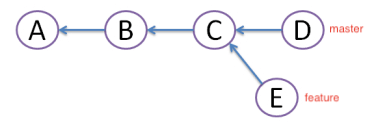
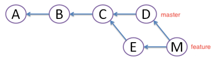
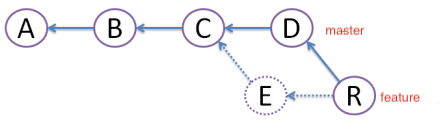

# Git

## 1. 基本操作

### 1.1 git配置


`git`的安装就不赘述了，通常在`git`安装之后我会做以下配置：

```bash
git config --global user.name 'xxx'
git config --global user.email 'xxx'
git config --global core.autocrlf false
git config --global core.safecrlf true
```

`windows`上安装`git`的时候也会有三个选项让用户选择，大概是`commit unix, checkout windows`，`commit windows, checkout windows`，`commit as it is ,checkout as it is`这三个选项，这其实就是在配置`autocrlf`

`crlf`是回车(CR, `\r`),换行(LF, `\n`)的意思，我们都知道`windows`上一般是回车换行`\r\n`结尾（CRLF），而`Linux/Unix`上一般是`\n`结尾（LF）

多人合作时，如果开发平台不一样，`windows`平台上可能会出现`ESLint`报`CRLF`相关的错误，因为`ESLint`默认要求是已`LF`结尾的，上面的配置可以解决这个问题，当然，`editorconfig`也可以统一换行符风格。

`autocrlf`取值`false`表示提交和检出代码时，均不做`CRLF`和`LF`相关的转换，原来是什么样就是什么样

`safecrlf`取值`true`表示拒绝提交包含混合换行符的文件，即：都用`LF`

下面是配置命令的别名，我习惯使用`git st`代替`git status`，`git co`代替`git checkout`，`git br`代替`git branch`

```bash
git config --global alias.st status
git config --global alias.co checkout
git config --global alias.br branch
```

### 1.2 仓库初始化

远程新建仓库，本地拉取仓库

```bash
git clone git@xxxx
```

本地初始化仓库，关联远程新仓库

```bash
git init
git remote add origin git@xxx
```

### 1.3 拉取代码

#### 1.3.1 `git fetch`

我个人使用`git fetch`的次数并不多，这里拿出来讲是为了更好的理解`git pull`

`git fetch`获取远程的更新并产生一个`FETCH_HEAD`，`FETCH_HEAD`里包含的信息供其他脚本或者`git`命令使用

#### 1.3.2 `git pull`

默认情况下，`git pull` = `git fetch` + `git merge`

而`git merge`默认情况下又会以`--ff`，即：`Fast Forward`模式合并代码，在`--ff`模式下

如果远程分支有更改，本地分支没更改，`git merge`不会产生一个新的提交

如果远程分支和本地分支都有更改，`git merge`就会产生一个合并提交，类似`Merge branch develop of xxxx(远程地址) into develop`，意思就是把远程的`develop`分支与本地的`develop`分支合并

***

如果`git pull`加上`--rebase`参数，那么合并分支就是采用`git rebase`而不是`git merge`，即：

`git pull --rebase` = `git fetch` + `git rebase`

`windows`安装`git`的时候，也会询问用户`git pull`默认是采用`git merge`还是`git rebase`，关于两者之间的区别，下面会讲到

### 1.4 推送代码

`git push`表示推送代码到远程，默认表示把当前本地分支(例如`develop`)推送到远程同名分支，即`git push` = `git push origin develop`

如果本地分支没有与远程分支关联，会提示使用`git push --set-upstream origin develop`，`--set-upstream`我习惯简写为`-u`，即：

`git push -u origin develop`

### 1.5 分支管理

#### 1.5.2 查看分支

`git branch`查看本地分支列表，`git branch -r`查看远程分支

#### 1.5.2 切换分支

`git checkout develop`会切换到本地`develop`分支，本地没有`develop`分支则会拉取远程`develop`分支，远程也没有`develop`分支的话则会报错

如果是别人刚推送的新分支，自己则需要`git pull`更新一下本地的信息再`git checkout`

#### 1.5.1 新建分支

`git branch new-branch`基于当前分支新建名为`new-branch`的分支，但是不会切换到`new-branch`分支，所以一般也不用这个

一般使用`git checkout -b new-branch`，基于当前分支新建名为`new-branch`的分支并切换到`new-branch`分支，即

`git checkout -b new-branch` = `git branch new-branch` + `git checkout new-branch`

#### 1.5.2 删除分支

`git branch -d new-branch`删除名为`new-branch`的分支

`git branch -D new-branch`**强制**删除名为`new-branch`的分支

### 1.6 分支合并

假设有以下分支，`master`为主分支，`feature`为自己的分支



#### 1.6.1 `git merge`



前面提到`git merge`默认会使用`Fast Forward`模式，可能不会产生合并提交，也就无法保存分支信息

`git merge --no-ff`，非`Fast Forward`模式，总是会产生一个合并提交

我个人习惯用`git merge --no-ff --no-commit`来合并分支，`--no-commit`表示不自动提交，不加的话在**没冲突**的情况下会自动提交合并的代码

加上`--no-commit`的好处是可以检查合并的代码是否符合预期

#### 1.6.2 `git rebase`



`git rebase`表示变基，我理解为把当前分支的提交在新的“基础”上再提交一遍，相比于`merge`，`rebase`能够让`git`树保持相对简洁

当然，`rebase`d

### 1.7 tag标签

#### 1.7.1 新赠tag

#### 1.7.2 推送tag到远程

#### 1.7.3 切换到指定tag

## 2. 工作流

### 2.1 Git Flow

### 2.2 我推荐的流程
