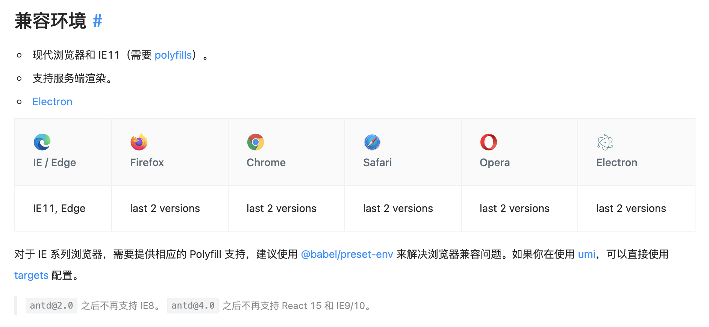

# browserslist

`browserslist`作用是指定我们的代码需要满足的浏览器（包括`node`）环境

像我们经常用到的`autoprefixer`, `babel`, `eslint-plugin-compat`, `postcss-preset-env`都依赖`browserslist`来帮我们适配各种浏览器

## 配置

可以在当前目录或者父目录的`package.json`里用`browserslist`数组配置，数组`query`之间是或的关系，取并集，官方推荐这种方式

```json
{
  "browserslist": ["defaults"]
}
```

也可以使用单独的文件配置，一般是`.browserslistrc`文件，我推荐这种方式

```yml
# 可以注释说明
# Browsers that we support
defaults
# 一行代表一个query，query就是查询浏览器的语句
# 行与行之间是 或 的关系，取并集
not IE 11
```

## query

简单举一些例子，不展开讲

- `defaults`，表示默认值，即`> 0.5%, last 2 versions, Firefox ESR, not dead`
- `> 5%`，表示全球使用数据超过`5%`的浏览器，`>=`, `<`, `<=`也可以使用
- `dead`，表示超过 24 个月没有更新和官方维护的浏览器，目前有`IE 10`，`IE_Mob 11`，`BlackBerry 10`，`BlackBerry 7`，`Samsung 4`，`OperaMobile 12.1`
- `last 2 versions`，每个浏览器的最近的两个版本
- `node 10`，表示`node 10.x.x`
- `ie 6-8`，表示`ie6 - ie8`
- `since 2015`，表示 2015 年后发布的版本
- `not ie <= 9`，表示**非**`ie9`及以下版本

## browsers

支持查询的浏览器有这些，名称不区分大小写

- `Android`，表示安卓`Webview`
- `Baidu`，表示百度浏览器
- `BlackBerry` 或 `bb`，表示黑莓浏览器
- `Chrome`，表示谷歌浏览器
- `ChromeAndroid` 或 `and_chr`，表示安卓端的谷歌浏览器
- `Edge`，表示微软`Edge`浏览器
- `Electron`，表示`Electron`版本，实际上会转换为`Chrome`版本
- `Explorer` 或 `ie`，表示万恶的`ie`浏览器
- `ExplorerMobile` 或 `ie_mob`，表示移动端`ie`浏览器
- `Firefox` 或 `ff`，表示火狐浏览器
- `FirefoxAndroid` 或 `and_ff`，表示安卓端火狐浏览器
- `iOS` 或 `ios_saf`，表示 IOS safari 浏览器
- `Node`，表示`Node`版本
- `Opera`，表示`Opera`浏览器
- `OperaMini`
- `OperaMobile`
- `QQAndroid` 或 `and_qq`，表示安卓端 QQ 浏览器（腾讯 x5 内核）
- `Safari`，mac 桌面端`safari`浏览器
- `Samsung`
- `UCAndroid` 或 `and_uc`，表示安卓端 UC 浏览器
- `kaios`

## 我应该怎么配置？

说了这么多，我还是不知道该配置成什么，因为我不知道用户会使用哪些浏览器来访问，所以怎么配置比较好？

我觉得是没有一个标准答案的，只能尽可能的往目标环境去靠拢，一般来说会以是否适配`ie`浏览器来区分，不适配的话，使用`defaults`就可以来，要适配的话就针对`ie`单独加上一个配置，比如要适配`ie9`以上的话，`browserslist`配置`> ie 9`

下面是`antd`的`browserslist`配置，其实就是`defaults` + `IE 11` + `not IE 10`

```json
{
  "browserslist": [
    "> 0.5%",
    "last 2 versions",
    "Firefox ESR",
    "not dead",
    "IE 11",
    "not IE 10"
  ]
}
```

然后`antd`对兼容环境的描述如下：


